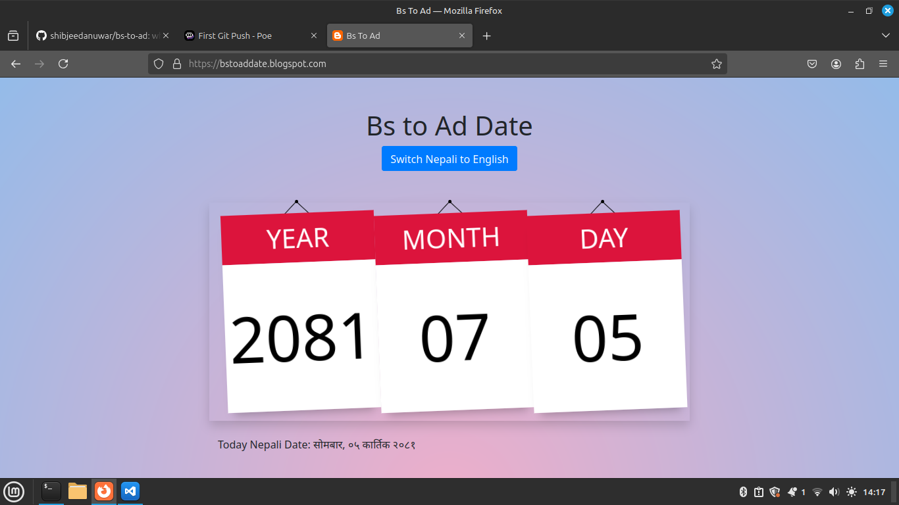

# How to convert bs to ad manually

A simple web application that converts dates between the Nepali calendar and the Gregorian calendar.
Convert bs to ad,
Convert bs to ad,
bs to ad converter,
translate bs to ad,
bs to ad,
date calculator bs to ad,
You can view the live demo of the Date Converter [here](https://bstoad.online/).

## Table of Contents

- [Features](#features)
- [Demo](#demo)
- [Installation](#installation)
- [Usage](#usage)
- [Contributing](#contributing)
- [License](#license)

## Features
- how to bs to ad date convert instruction
- Convert Nepali dates to English dates and vice versa.
- bs to ad  or ad to bs
- User-friendly interface with Bootstrap styling.
- Responsive design for mobile and desktop.
- checkout [here](https://bstoad.online/).

## Demo

You can view the live demo of the Date Converter [here](https://bstoad.online/).



## Installation

To run this project locally, follow these steps:

1. Clone the repository:

   ```bash
   git clone https://github.com/shibjeedanuwar/bs-to-ad.git
  
